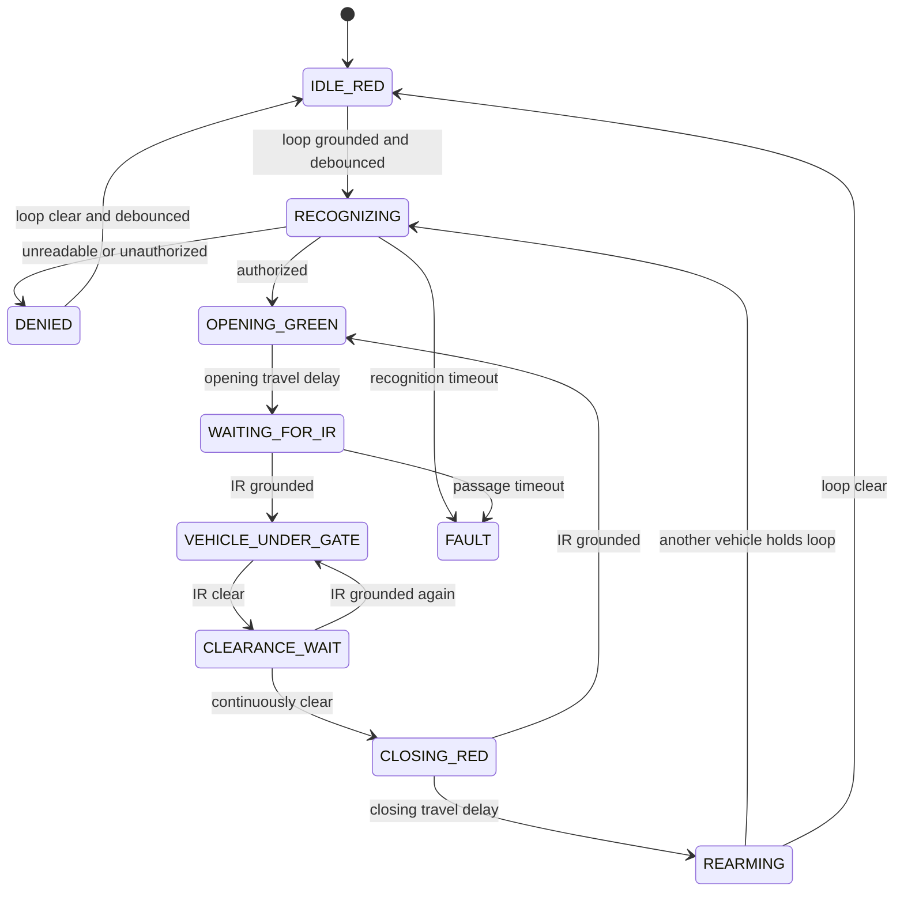

# Implemented Gate-Control Logic

## Electrical contract

The Raspberry Pi uses five BCM GPIO lines:

| Signal | GPIO behavior |
| --- | --- |
| Inductive loop | Input with pull-up; short to GND means vehicle present |
| IR beam | Input with pull-up; short to GND means beam broken |
| Traffic selector | LOW means red; HIGH means green |
| Open command | HIGH for one second, otherwise LOW |
| Close command | HIGH for one second, otherwise LOW |

The open and close outputs are mutually exclusive. All three outputs start and
stop LOW, which means red traffic indication with no movement request.

## Automatic sequence

1. The controller starts red with both movement outputs LOW.
2. The inductive-loop switch must remain grounded for the debounce interval.
3. One cycle is locked and the reader captures three fresh frames.
4. YOLO detects the strongest plate crop in each frame.
5. Each plate row is converted to grayscale and PP-OCRv5 produces a consensus.
6. The plate and crop are sent to the PC website for MySQL authorization.
7. Unreadable, unregistered, expired, inactive, or failed server results remain
   red and produce no movement pulse. The loop must clear before retrying.
8. An authorized result switches the traffic output HIGH and pulses OPEN HIGH
   for exactly one second.
9. After the configured opening travel delay, the controller waits for the IR
   input to be grounded, indicating that the vehicle is beneath the barrier.
10. When the IR input opens again, it must remain clear for the configured
    clearance interval.
11. Traffic switches LOW to red and CLOSE pulses HIGH for exactly one second.
12. After the configured closing travel delay, the active cycle unlocks.
13. A vehicle already holding the loop input grounded starts one new cycle
    after debounce. Loop activity cannot start a second recognition while the
    current cycle is active.

## Obstruction behavior

If the IR input becomes grounded during the closing phase, CLOSE returns LOW
and the controller immediately enters opening again, switching green and
pulsing OPEN for one second. The software never requests close while IR is
blocked.

If no vehicle passage is detected before the passage timeout, or recognition
does not complete before its timeout, the controller enters `FAULT`: traffic
red, OPEN LOW, and CLOSE LOW.

## State machine



## Implementation files

- `src/gate_controller.cpp`: deterministic state machine and safety interlock
- `src/gate_gpio.cpp`: Raspberry Pi libgpiod input/output backend
- `src/main.cpp`: three-frame recognition and server-authorization integration
- `src/gate_simulator.cpp`: macOS and bench simulator
- `tests/gate_controller_tests.cpp`: automated timing and obstruction tests
- `docs/GATE_WIRING_DIAGRAM.md`: GPIO/header wiring diagram

## Activation

GPIO support is built by `build_raspberry_pi.sh`. Automatic gate mode remains
off until the private `.env` contains:

```text
GATE_MODE=1
```

This explicit enable prevents a normal software update from pulsing connected
hardware unexpectedly.
