# Boom Barrier Gate-Control Plan

## Implementation status

The hardware-independent C++ `GateController`, interactive simulator, GPIO
reservation, isolated wiring diagram, and automated safety tests are now
implemented. Physical GPIO movement remains disabled until the exact boom
controller, sensors, relay modules, signal voltages, and active polarities are
confirmed. Recognition and website status integration are the next phase.

## Objective

Extend the existing C++ plate reader so the Raspberry Pi safely coordinates:

- An inductive-loop vehicle-presence sensor
- Single-frame YOLO and OCR plate recognition
- Remote PC API vehicle authorization
- A boom barrier controller
- An IR or photoelectric passage-safety sensor
- Barrier-open and barrier-closed limit feedback
- Red and green gate traffic lights
- The separate PC-hosted Flask monitoring website

The C++ process will be the authoritative real-time controller. Flask will
display status and history but will not own the safety sequence.

## Safety boundary

The Raspberry Pi must operate only the low-voltage control inputs of the boom
barrier through correctly rated, opto-isolated interfaces or dry-contact
relays. It must never drive the barrier motor directly.

The IR or photoelectric obstruction sensor must also connect to the barrier
controller's dedicated safety or close-interrupt input. The C++ software will
monitor the same safety condition, but software must not be the only protection
against closing on a person or vehicle.

The barrier controller should provide physical open-limit, closed-limit, and
fault feedback. Timing alone is not sufficient proof of the barrier's position.

Commercial gate-safety guidance calls for dedicated entrapment protection such
as monitored photoelectric sensors and/or reversing edges:

- [LiftMaster gate safety guidance](https://www.liftmaster.com/about-liftmaster/safety)
- [LiftMaster operator manual: entrapment protection and close-interrupt input](https://partner.liftmaster.com/medias/CSL24UL-0139381.pdf?attachment=true&context=bWFzdGVyfGxpdGVyYXR1cmV8OTY2MjU0N3xhcHBsaWNhdGlvbi9wZGZ8bGl0ZXJhdHVyZS9oMmQvaDI2LzkwMzg4NTcyMDc4MzgucGRmfDFiMjVhZjAyZWU0ZDk0MmYwYTczNWRiNGU2NmM3YTk2MWQ5MzJhZmM0NGI5MzdlZjU2NmI4YjhlNTMyMWJhMGY)

Final electrical installation and safety validation must be performed by a
qualified gate installer or controls electrician using the barrier
manufacturer's instructions and applicable local requirements.

## Normal operating sequence

1. The boom is confirmed closed.
2. The red light is on and the green light is off.
3. The controller waits in the `IDLE_CLOSED` state.
4. The inductive loop reports a vehicle continuously for the configured
   debounce period.
5. The controller locks the gate cycle so no second recognition cycle can
   overlap it.
6. The camera captures one fresh frame.
7. YOLO detects the plate, the best crops are enhanced, and OCR consensus
   produces a clean uppercase alphanumeric value.
8. The recognition result is sent to the PC API, which checks for an active registered vehicle.
9. An unreadable, unregistered, inactive, expired, or failed lookup keeps the
   barrier closed and the red light on.
10. An authorized result turns the red light off, turns the green light on,
    and requests barrier opening.
11. The barrier-open limit must be reached before the opening timeout.
12. The controller waits for the passage sensor to become blocked and then
    continuously clear for the configured clearance period.
13. The green light turns off and the red light turns on before closing.
14. Closing is requested only while the safety sensor is clear.
15. The barrier-closed limit must be reached before the closing timeout.
16. The cycle lock is released only after the boom is confirmed closed.
17. If another vehicle is still occupying the inductive loop, its recognition
    begins as the next cycle. Otherwise, the controller returns to idle.

## State machine

```mermaid
stateDiagram-v2
    [*] --> STARTUP
    STARTUP --> IDLE_CLOSED: sensors healthy and boom closed
    STARTUP --> FAULT: unsafe or unknown state

    IDLE_CLOSED --> RECOGNIZING: loop occupied and debounced
    RECOGNIZING --> DENIED: unreadable or unauthorized
    RECOGNIZING --> OPENING: authorized
    RECOGNIZING --> FAULT: camera, model, network, or server failure

    DENIED --> REARMING: loop clears

    OPENING --> GATE_OPEN: open limit reached
    OPENING --> FAULT: opening timeout or barrier fault

    GATE_OPEN --> VEHICLE_PASSING: passage sensor blocked
    GATE_OPEN --> FAULT: passage timeout
    VEHICLE_PASSING --> CLEARANCE_WAIT: passage sensor clears
    CLEARANCE_WAIT --> VEHICLE_PASSING: passage sensor blocks again
    CLEARANCE_WAIT --> CLOSING: sensor continuously clear

    CLOSING --> GATE_OPEN: obstruction detected; stop or reopen
    CLOSING --> REARMING: closed limit reached
    CLOSING --> FAULT: closing timeout or barrier fault

    REARMING --> RECOGNIZING: next vehicle remains on loop
    REARMING --> IDLE_CLOSED: loop clear
    FAULT --> STARTUP: inspected and administrator reset
```



## Gate-cycle interlock

The inductive loop will report vehicle presence; it will not directly send a
capture command.

The controller will maintain a `cycle_active` lock:

- It becomes true when a vehicle starts recognition.
- It remains true through recognition, opening, passage, and closing.
- Loop transitions are ignored as capture triggers while it is true.
- The current loop level is still observed so a waiting vehicle can be handled
  after the barrier closes.
- It becomes false only after the closed-limit sensor confirms closure.

The next vehicle's earlier rising edge will not be queued. After the active
cycle closes, the controller reads the current loop level. If the loop remains
occupied, it starts exactly one new cycle. This avoids both lost waiting
vehicles and overlapping capture commands.

## Tailgating and passage safety

The passage sensor protects the closing zone but cannot reliably identify two
vehicles traveling extremely close together.

The controller will therefore:

- Require the passage sensor to be continuously clear for a configurable
  interval before closing
- Cancel closing and request reopening if the sensor becomes blocked
- Keep the cycle locked while the boom is open or moving
- Record a prolonged obstruction or passage timeout as a fault
- Default to no closing command whenever sensor state is uncertain

The barrier controller's direct hardware safety input remains responsible for
the immediate stop/reopen response if the Pi, GPIO library, or C++ process
fails.

## Hardware interface definition

Exact voltages, active levels, and contact behavior must be confirmed before
GPIO pin numbers are assigned.

### Inputs

| Logical input | Purpose | Required behavior |
| --- | --- | --- |
| `loop_present` | Vehicle waiting before boom | Level signal with debounce |
| `passage_blocked` | Vehicle/person within closing zone | Fail-safe obstruction signal |
| `boom_fully_open` | Confirms completed opening | Physical limit feedback |
| `boom_fully_closed` | Confirms completed closing | Physical limit feedback |
| `boom_fault` | Optional controller fault feedback | Forces software fault state |

### Outputs

| Logical output | Purpose | Safe default |
| --- | --- | --- |
| `request_open` | Momentary dry-contact request to barrier controller | Off |
| `request_close` | Momentary dry-contact request to barrier controller | Off |
| `red_light` | Stop indication | On |
| `green_light` | Authorized movement indication | Off |

Input and output polarity must be configurable. No GPIO pin assignment will be
hardcoded into recognition logic.

## C++ software structure

The current plate-reader executable will be extended with testable components:

```text
plate_reader
├── camera and single-frame capture
├── YOLO detection and crop enhancement
├── OCR consensus
├── Authenticated PC API client
├── GateController state machine
├── SensorDebouncer
├── GpioBackend interface
│   ├── LibgpiodBackend for Raspberry Pi
│   └── SimulatedGpioBackend for macOS and automated tests
├── BarrierOutputController
└── system-status publisher
```

The Raspberry Pi backend will use `libgpiod`. The simulated backend will allow
the same state machine to run on macOS without physical GPIO hardware.

## Configuration

The following values will be configurable instead of compiled into the code:

- GPIO chip and line assignments
- Active-high or active-low polarity
- Input debounce duration
- Passage-sensor clear duration
- Barrier open and close relay pulse duration
- Opening timeout
- Passage timeout
- Closing timeout
- Fault-reset behavior
- Recognition retry count
- Whether a local maintenance capture command is enabled

Configuration will be validated at startup. Missing or contradictory safety
settings will prevent automatic operation.

## Recognition behavior

- Recognition runs only in `RECOGNIZING`.
- Only one recognition attempt belongs to a gate cycle.
- Additional loop activity cannot start parallel inference.
- Failure defaults to denied access.
- Plate formatting remains country-neutral: uppercase letters and numbers only.
- A denied vehicle must clear the loop before it can trigger another attempt.
- The single-frame YOLO and OCR pipeline remains the recognition pipeline
  unless separately changed and tested.

## Database changes

The existing `access_events` record will continue to store the plate,
authorization decision, server event ID, and detector confidence. Gate-cycle logging
will additionally capture:

- Unique cycle identifier
- Loop-detection timestamp
- Recognition start and completion timestamps
- Recognition duration
- Barrier-open request and confirmation timestamps
- Passage-blocked and passage-clear timestamps
- Barrier-close request and confirmation timestamps
- Final gate action: opened, kept closed, or error
- Fault or timeout reason
- Total cycle duration

`system_status` will expose the current controller state, loop state, passage
sensor state, barrier position, last fault, and heartbeat.

## Website changes

The dashboard will display:

- Controller state
- Boom position
- Loop clear or occupied
- Passage sensor clear or blocked
- Red and green light state
- Active-cycle plate and owner
- Vehicle-waiting indicator
- Current fault or timeout
- Recent gate-cycle outcomes

Security-guard accounts remain read-only. Administrators may acknowledge a
fault after physical inspection, but the website must not issue an unsafe close
command or bypass a blocked safety sensor.

## Failure behavior

The controller enters `FAULT` when:

- Required GPIO cannot be initialized
- Barrier position is unknown at startup
- Open and closed limits are simultaneously active
- The boom fails to reach a limit before its timeout
- The barrier controller reports a fault
- The passage sensor remains blocked beyond its timeout
- A safety sensor disconnects or reports an invalid state
- The PC API, network, or recognition pipeline fails during an automatic cycle

Default fault outputs are red on, green off, and no automatic movement request.
Fault recovery requires a healthy sensor state and explicit acknowledgement.

## Implementation phases

### Phase 1: Hardware contract

- Obtain barrier-controller wiring documentation
- Confirm sensor and relay voltage levels
- Confirm open, close, safety, and limit terminals
- Select isolation and relay hardware
- Record the final GPIO mapping

### Phase 2: GPIO abstraction and simulator

- Add the `GpioBackend` interface
- Implement debounced input readings
- Implement safe output initialization
- Add the macOS simulator
- Add state-transition unit tests

### Phase 3: State machine

- Implement all controller states and allowed transitions
- Add the cycle lock and waiting-vehicle behavior
- Add timeouts, fault transitions, and structured logs
- Verify that no unsafe state can issue a close request

### Phase 4: Recognition integration

- Replace direct loop-to-capture behavior with a state-machine event
- Run the single-frame recognition pipeline only in `RECOGNIZING`
- Connect the PC API authorization response to `OPENING` or `DENIED`
- Prevent repeated attempts while a denied vehicle remains on the loop

### Phase 5: PC API and website integration

- Add cycle and hardware status fields
- Publish controller heartbeat and fault details
- Add dashboard sensor and barrier indicators
- Preserve administrator and guard permissions

### Phase 6: Bench testing

- Run simulated vehicle sequences on macOS
- Run GPIO simulation on Raspberry Pi
- Connect sensors with the barrier motor disconnected
- Verify relay pulses at controller test inputs
- Test startup and shutdown safe states

### Phase 7: Controlled barrier commissioning

- Test movement without vehicles
- Block the safety sensor before closing
- Block the safety sensor during closing
- Test a waiting second vehicle
- Test closely following vehicles
- Test sensor disconnection, network/server failure, camera failure, and Pi restart
- Perform supervised live-vehicle trials

## Acceptance criteria

The implementation is complete only when all of the following pass:

- Exactly one recognition attempt occurs per active cycle.
- No second capture starts while the barrier is open or moving.
- A vehicle waiting on the loop starts only after the previous boom cycle is
  confirmed closed.
- An unreadable or unauthorized plate never generates an open request.
- The boom never receives a software close request while the passage sensor is
  blocked.
- Obstruction during closing causes stop/reopen behavior at both the barrier
  controller and software state-machine levels.
- Red is on and green is off during idle, denial, closing, startup uncertainty,
  and faults.
- Green is on only for an authorized active passage cycle.
- Open and close timeouts enter a visible fault state.
- Restarting the Pi cannot accidentally pulse either movement relay.
- The macOS simulator and Raspberry Pi GPIO backend follow the same state
  transitions.
- Database and dashboard state agree with the physical controller feedback.

## Items required before implementation

Before coding the physical GPIO backend, provide:

1. Boom barrier brand and exact model
2. Barrier controller wiring diagram
3. Inductive-loop detector model and output specification
4. IR/photoelectric sensor model and output specification
5. Available open, closed, safety, and fault terminals
6. Relay/interface-board model
7. Preferred Raspberry Pi GPIO assignments, if already wired

The simulator and state-machine tests can be implemented before those hardware
details are available, but real GPIO outputs must remain disabled until the
electrical interface is confirmed.
