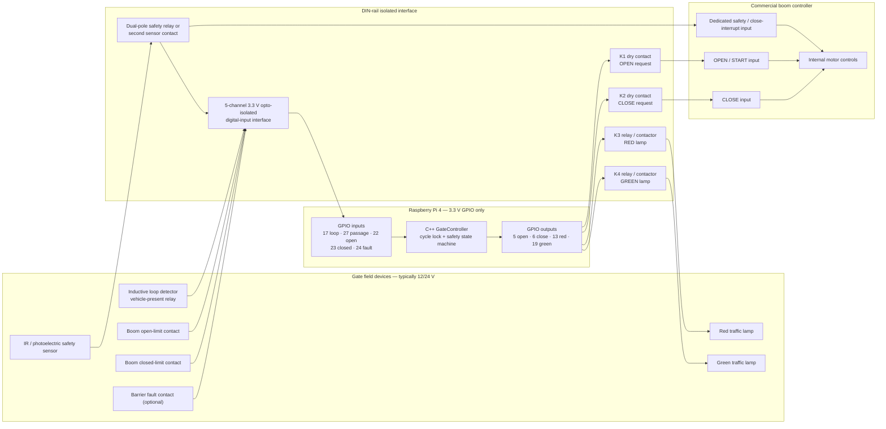

# Raspberry Pi Boom-Barrier Wiring Diagram

## Safety scope

The Raspberry Pi controls only isolated, low-voltage control contacts. It must
never power the boom motor, traffic lamps, loop, or safety sensor directly.

The passage photoelectric/IR sensor must operate the boom controller's hardware
`SAFETY`, `PHOTO`, or `CLOSE INTERRUPT` input even if the Raspberry Pi is off.
The Pi receives a separate isolated copy of that signal for sequencing. Use a
sensor with two independent contacts or an approved interposing relay; do not
join unrelated controller and Pi circuits together.

Do not connect 5 V, 12 V, or 24 V field signals to a Raspberry Pi GPIO pin.
Use 3.3 V-compatible opto-isolated digital-input modules and dry-contact relay
outputs. A qualified gate installer or controls electrician must confirm the
final terminals, voltages, fusing, earthing, and enclosure.

## System wiring

## Proposed Raspberry Pi GPIO assignment

These lines are reserved in `config/gate.env.example`. They are not enabled by
default and can be changed before the physical backend is commissioned.

| Signal | BCM GPIO | Header pin | Direction | Interface | Safe state |
| --- | ---: | ---: | --- | --- | --- |
| Vehicle loop occupied | 17 | 11 | Input | Isolated DI channel 1 | Clear |
| Passage blocked | 27 | 13 | Input | Isolated DI channel 2 | Treat disconnect as blocked |
| Boom fully open | 22 | 15 | Input | Isolated DI channel 3 | Inactive |
| Boom fully closed | 23 | 16 | Input | Isolated DI channel 4 | Must be active before automatic mode |
| Barrier fault | 24 | 18 | Input | Isolated DI channel 5 | Treat disconnect as fault |
| Open request K1 | 5 | 29 | Output | Opto-isolated dry-contact relay | Relay off |
| Close request K2 | 6 | 31 | Output | Opto-isolated dry-contact relay | Relay off |
| Red lamp K3 | 13 | 33 | Output | Relay/contactor sized for lamp | On |
| Green lamp K4 | 19 | 35 | Output | Relay/contactor sized for lamp | Off |

Use a Pi ground pin only on the Pi side of an isolation module. Keep the field
power-supply negative isolated unless the interface manufacturer's wiring
instructions explicitly require a common reference.

## Contact-side connections

1. Connect K1 `COM` and `NO` across the boom controller's low-voltage `COM` and
   `OPEN` terminals.
2. Connect K2 `COM` and `NO` across `COM` and `CLOSE` only if the controller has
   a dedicated close input. Some barriers provide only a step/start input; that
   requires model-specific logic and must not be guessed.
3. Connect the IR sensor directly to the controller's monitored safety input.
   Use a second pole/contact for the Pi passage input.
4. Connect physical open- and closed-limit feedback contacts to isolated input
   channels. Timing is not accepted as proof of boom position.
5. Power the lamps from their rated, fused supply through K3/K4 contacts. For
   mains-powered lamps, use appropriately rated contactors inside a protected
   enclosure and have an electrician complete the mains wiring.

## Startup and shutdown behavior

- Both movement relays are off before GPIO initialization and after shutdown.
- Red is on and green is off during startup, denial, closing, and faults.
- Automatic operation starts only when the closed limit is confirmed, the open
  limit is inactive, the safety path is clear, and no barrier fault is active.
- Simultaneous open and closed limits force a fault.
- A blocked passage input can never produce a software close request.
- The commercial controller's safety input remains the primary, immediate
  stop/reopen protection.

## Information still required before enabling GPIO

- Boom barrier manufacturer and exact model
- Controller terminal/wiring manual
- Inductive-loop detector model and output contact rating
- IR/photoelectric sensor model and safety-output behavior
- Open/closed/fault feedback voltage or contact specification
- Isolation/relay module model and whether its logic is active-high or active-low
- Traffic-light voltage and current

The final pin polarity and contact wiring must be entered only after those
details are confirmed with a meter and the manufacturer documentation.
