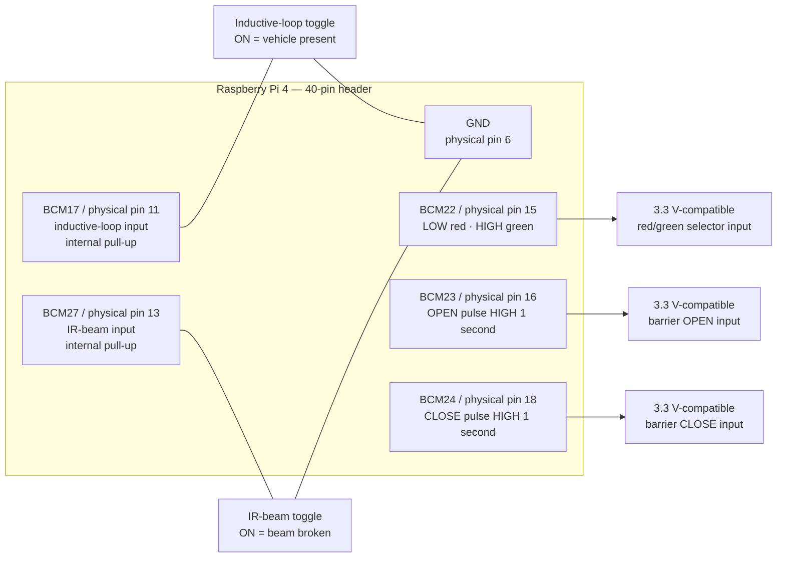

# Simplified Raspberry Pi Gate Wiring

## GPIO behavior

The two switches connect their GPIO input directly to Raspberry Pi ground when
active. The program enables the GPIO's internal pull-up resistor.

- Switch open: input reads HIGH and is inactive.
- Switch closed to GND: input reads LOW and is active.
- Traffic output LOW: red.
- Traffic output HIGH: green.
- Open and close outputs: normally LOW; the selected output goes HIGH for
  exactly one second and then returns LOW.
- Open and close are never driven HIGH together.

## Wiring diagram



## Pin table

Use BCM numbers in software. Physical pin numbers refer to the Raspberry Pi
40-pin header.

| Function | BCM GPIO | Physical pin | Electrical behavior |
| --- | ---: | ---: | --- |
| Inductive-loop toggle | 17 | 11 | Short to GND means vehicle present |
| IR-beam toggle | 27 | 13 | Short to GND means vehicle under barrier |
| Traffic red/green selector | 22 | 15 | LOW red, HIGH green |
| Barrier open command | 23 | 16 | HIGH for one second |
| Barrier close command | 24 | 18 | HIGH for one second |
| Switch return/common | — | 6 | Raspberry Pi GND |

Other ground pins such as physical pins 9, 14, 20, 25, 30, 34, or 39 may also
be used.

## Toggle-switch connections

For each input toggle:

```text
BCM GPIO input ---- toggle switch ---- Raspberry Pi GND
```

Do not connect either input switch to 3.3 V or 5 V. The internal pull-up already
provides the inactive HIGH state.

## Output requirements

The three outputs are Raspberry Pi 3.3 V logic signals only. They are not
5 V-tolerant and cannot accept or switch 12/24 V directly.

If the traffic controller or barrier inputs are not explicitly compatible with
3.3 V logic, connect each GPIO through an opto-isolator, transistor interface,
or appropriate relay module. Never connect a higher-voltage barrier signal
directly to the Pi.

At program startup and shutdown, BCM22, BCM23, and BCM24 are driven LOW. This
selects red and prevents accidental open or close commands.

## Enable automatic gate mode

After wiring and testing the pins, set this in the controller's private `.env`:

```text
GATE_MODE=1
```

The remaining optional values and default pin assignments are listed in
`config/gate.env.example`.
